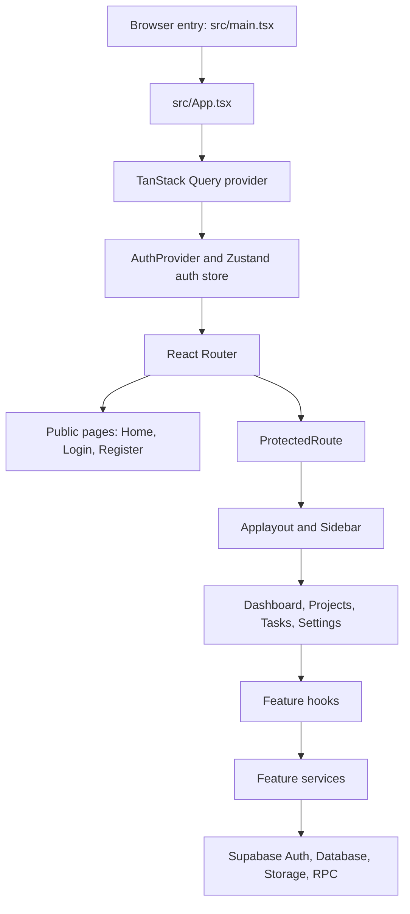

# ProjectTasker App Logic Guide

This guide explains how the application is put together, how a browser request travels through it, and where to look when changing a feature. It is written for someone learning the codebase, not just someone already familiar with its libraries.

## 1. The Big Picture

ProjectTasker is a browser application built with React and TypeScript. A user signs in with Supabase Auth, then works with projects and tasks. The browser uses TanStack Query to load and cache server data, and feature services use the Supabase client to talk to the backend.

At a high level:



A useful way to read the app is from the outside inward:

1. [src/main.tsx](../src/main.tsx) mounts the React tree.
2. [src/App.tsx](../src/App.tsx) installs shared providers.
3. [src/app/router/index.tsx](../src/app/router/index.tsx) maps URLs to pages.
4. A page reads state and calls feature hooks.
5. A hook calls a service and manages server state.
6. A service calls Supabase or the AI SDK.
7. Query results flow back into the page and its components.

## 2. Project Structure

```text
src/
  main.tsx                     Browser entry point
  App.tsx                      Shared application providers
  app/
    providers/AuthProvider.tsx Loads Supabase session and listens for auth changes
    router/                    Public and protected routes
    store/authStore.ts         Small Zustand store for the active session/user
  components/
    layout/                    Shared signed-in app shell
    ui/                        Reusable buttons, dialogs, inputs, sidebar, etc.
    SideBar.tsx                Main workspace navigation
  features/
    home/                      Public landing page
    auth/                      Login, registration, logout
    dashboard/                 Cross-project overview
    projects/                  Project list, forms, collaborator management
    tasks/                     Task page, forms, AI generation, task data
    settings/                  Profile display and avatar upload
  lib/supabase/client.ts       Browser Supabase client
```

Most application behavior is organized by feature. For example, task-specific pages, schemas, hooks, services, components, and types live under `src/features/tasks/`. Shared primitives such as `Button` and `Dialog` live under `src/components/ui/`.

The `@/` import alias points to `src/`. For instance, `@/features/tasks/Tasks` means `src/features/tasks/Tasks.tsx`.

## 3. Navigation and Route Flow

The route definitions are in [src/app/router/index.tsx](../src/app/router/index.tsx).

| URL              | Page                | Access         |
| ---------------- | ------------------- | -------------- |
| `/`              | Home / landing page | Public         |
| `/login`         | Login form          | Public         |
| `/register`      | Registration form   | Public         |
| `/app/dashboard` | Dashboard           | Signed-in user |
| `/app/projects`  | Project list        | Signed-in user |
| `/app/tasks`     | Task workspace      | Signed-in user |
| `/app/settings`  | Profile settings    | Signed-in user |

The protected routes are nested inside [ProtectedRoute](../src/app/router/ProtectedRoute.tsx). When the user is not authenticated, that component returns a React Router `<Navigate>` to `/login`. When authenticated, it renders an `<Outlet>`, which is where the child route appears.

The `/app` route renders [Applayout](../src/components/layout/Applayout.tsx). The layout owns the shared sidebar and header, then renders the selected page inside another `<Outlet>`.

The task page can select a project using a query parameter:

```text
/app/tasks?project=<project-id>
```

`Tasks.tsx` reads that parameter using `useSearchParams()`. This lets dashboard project cards open the correct project's tasks without adding a separate route for every project.

## 4. Providers and Application State

### React Query: server state

[src/App.tsx](../src/App.tsx) creates a `QueryClient` and wraps the application in `QueryClientProvider`. TanStack Query manages data that comes from the server: projects, tasks, collaborators, and profiles.

The main ideas are:

- A **query** loads data and stores it in a cache under a query key.
- A **mutation** creates, updates, or deletes data.
- After a mutation, the hook invalidates matching query keys so React Query reloads the affected data.

For example, task list queries use keys such as:

```ts
["tasks", projectId];
```

The key identifies both the kind of data and which project's tasks it represents.

### Zustand: authentication state

[src/app/store/authStore.ts](../src/app/store/authStore.ts) stores the current Supabase `session`, `user`, and an `isAuthenticated` flag. It is intentionally small; it is not the store for projects or tasks.

[AuthProvider](../src/app/providers/AuthProvider.tsx) loads the first session with `supabase.auth.getSession()`, then subscribes to `onAuthStateChange()`. It writes the session to Zustand and shows a spinner until the initial session check finishes.

### React `useState`: temporary UI state

Component-local state is used for temporary choices that do not need to be stored on the server. Examples include:

- whether a dialog is open;
- the current search string or filter selection;
- which task is being edited;
- whether a password is visible;
- the selected collaborators before a form is saved.

### React Hook Form and Zod: form state and validation

Forms use React Hook Form to track entered values, submission, and validation errors. `zodResolver` connects a Zod schema to the form. The schema validates data before the component calls its mutation.

In the task form, `taskFormSchema` validates title, description, status, priority, and assignee. Database-owned fields such as `project_id`, `created_by`, and `source` are added by application logic rather than requested from the person filling in the form.

## 5. Authentication Workflow

### Sign in

1. `Login.tsx` validates email and password with React Hook Form and Zod.
2. It calls Supabase Auth's `signInWithPassword()`.
3. `AuthProvider` receives the auth event and updates the Zustand store.
4. On success, the login page navigates to `/app/dashboard`.
5. `ProtectedRoute` allows the page to render because `isAuthenticated` is true.

### Register

`Register.tsx` checks username availability through a Supabase RPC, then calls `supabase.auth.signUp()` with name and username metadata. It navigates to `/login` on success. The profile row is expected to be created/maintained by the project's Supabase setup; the browser registration component does not directly insert a row into `profiles`.

### Sign out

`Logout.tsx` calls `supabase.auth.signOut()` and navigates to `/login`. The auth provider listens for the sign-out event and clears the Zustand auth state.

## 6. Backend Data and Service Boundaries

The browser Supabase client is created in [src/lib/supabase/client.ts](../src/lib/supabase/client.ts) from:

- `VITE_SUPABASE_URL`
- `VITE_SUPABASE_PUBLISHABLE_KEY`

The `VITE_` prefix means these values are available to browser code. A Supabase publishable key is intended for this use; never put a Supabase service-role/secret key in a `VITE_` variable.

Feature services own direct backend calls. UI components should call hooks, and hooks should call services, rather than embedding database queries throughout the page.

Current data model used by the app:

| Table                   | Purpose                                                       |
| ----------------------- | ------------------------------------------------------------- |
| `profiles`              | Display name, username, email, avatar, and profile data       |
| `projects`              | Project title, description, owner, and timestamps             |
| `project_collaborators` | Links users to projects and records their role                |
| `tasks`                 | Project work, status, priority, assignee, creator, and source |

The important task fields have different meanings:

- `project_id`: which project contains the task;
- `created_by`: who created the task;
- `assigned_to`: who is responsible for doing it;
- `source`: whether it was entered manually or generated by AI.

## 7. Project Workflow

The project page is [Projects.tsx](../src/features/projects/Projects.tsx). It reads the signed-in user from Zustand and calls `useProject(userId)`.

`useProject()` is defined in [useProjects.ts](../src/features/projects/hooks/useProjects.ts). Its query function calls `getProjects()` in [projectService.ts](../src/features/projects/services/projectService.ts). That service:

1. fetches projects owned by the current user;
2. fetches the user's project-collaborator rows;
3. fetches those invited projects;
4. returns two groups: `owned` and `invited`.

[ProjectList.tsx](../src/features/projects/components/ProjectList.tsx) renders a section and card for each project. Each card reads collaborators and tasks with hooks. Owners can edit the project and manage collaborators. Invited-project cards are rendered read-only by the UI.

### Creating a project

[CreateProjectDialog.tsx](../src/features/projects/components/CreateProjectDialog.tsx) uses React Hook Form and `createProjectSchema`. It also searches usernames and keeps selected users in local component state. On submit:

```text
Form values
  -> createProjectSchema validation
  -> useCreateProject mutation
  -> createProject service
  -> insert project row
  -> insert collaborator rows
  -> invalidate ["projects"]
  -> project lists reload
```

Creating a project does not generate tasks. AI task generation happens on the task page when the owner chooses that action.

## 8. Task Workflow

The task feature is under `src/features/tasks/`:

| File or folder                                                            | Responsibility                                                            |
| ------------------------------------------------------------------------- | ------------------------------------------------------------------------- |
| [Tasks.tsx](../src/features/tasks/Tasks.tsx)                              | Select project, determine UI role, coordinate task page state and actions |
| [task.types.ts](../src/features/tasks/types/task.types.ts)                | Shared Task, status, priority, source, insert, and update types           |
| [task.schema.ts](../src/features/tasks/schemas/task.schema.ts)            | Zod validation for manual tasks and AI result data                        |
| [useTasks.ts](../src/features/tasks/hooks/useTasks.ts)                    | TanStack Query reads and mutation hooks                                   |
| [task.service.ts](../src/features/tasks/services/task.service.ts)         | Direct Supabase task and RPC calls                                        |
| [TaskFormDialog.tsx](../src/features/tasks/components/TaskFormDialog.tsx) | Owner create/edit form                                                    |
| [TaskList.tsx](../src/features/tasks/components/TaskList.tsx)             | Task cards, details dialog, role-aware actions                            |
| [Ai.tsx](../src/features/tasks/services/Ai.tsx)                           | Gemini model selection, prompt, JSON parsing, retry logic                 |

### Loading the page

1. `Tasks.tsx` reads the current user from Zustand.
2. It loads owned and invited projects with `useProject(userId)`.
3. It reads `project` from the URL query string, and selects that project.
4. The page compares `selectedProject.owner_id` with `user.id` to choose owner or collaborator controls.
5. It calls `useTasks(projectId)`. The service query includes `.eq("project_id", projectId)`.
6. Supabase Row Level Security (RLS), not the React filter, must restrict which rows the user may actually receive.

Client-side search, filters, and sorting only operate on the rows the backend returned. They are presentation controls, not authorization.

### Creating and editing manually

`TaskFormDialog.tsx` connects React Hook Form to `taskFormSchema`. For a new task it adds trusted fields before calling `useCreateTask()`:

```ts
const insert = {
  ...formValues,
  project_id: projectId,
  created_by: userId,
  source: "manual",
};
```

For edits, it sends only the editable fields to `useUpdateTask()`. On success the mutation invalidates the matching `["tasks", projectId]` cache key, which causes the list and other observers of that project to refresh.

### Deleting

The owner opens a confirmation dialog. Confirming calls `useDeleteTask()`, which calls `deleteTask()` in the service, then invalidates the project task list. The backend must reject deletes by non-owners even if someone calls Supabase outside the UI.

### Completing a collaborator task

The collaborator's only task mutation in the UI is “Mark as complete.” It calls `useCompleteTask()`, which invokes the database RPC:

```ts
supabase.rpc("complete_task", { task_id: taskId });
```

This RPC is intentionally narrower than a normal task update: it should verify the caller is the assignee and only write `status = 'done'` and `updated_at`. The app expects this function to exist in Supabase. The current workspace has no checked-in `supabase/` directory, so the function and RLS policies are configured outside this repository. Keep the hosted database policies aligned with the intended owner/collaborator model; hiding buttons in React is not a security boundary.

The app uses these task statuses:

- `todo`
- `in_progress`
- `done`
- `canceled`

And these priorities:

- `low`
- `medium`
- `high`

### AI generation

The task page builds a `GenerateTasksPayload` from the selected project, owner, and collaborator IDs. `Ai.tsx` uses project title and description in the prompt and asks Gemini to return task content. The response is parsed as JSON and validated by `generatedTasksSchema`.

The browser then normalizes each generated task before inserting it:

```ts
{
  project_id: selectedProject.id,
  title: generated.title,
  description: generated.description,
  priority: generated.priority,
  status: "todo",
  assigned_to: collaborators.length
    ? collaborators[index % collaborators.length].id
    : null,
  created_by: user.id,
  source: "ai",
}
```

The model does not get to choose database identity fields. `useCreateTasks()` sends the complete batch to the service for one bulk insert, then invalidates that project's task query.

The Gemini SDK is called from browser code with `VITE_GEMINI_API_KEY`. A Vite-prefixed key is visible to users in the built client. For production use, keep secret credentials out of browser bundles; proxy model requests through a server or Edge Function and apply provider-side restrictions/quotas.

## 9. Dashboard and Settings

### Dashboard

[`Dashboard.tsx`](../src/features/dashboard/Dashboard.tsx) combines:

- `useProject(userId)` for owned and shared projects;
- `useTasksForProjects(projectIds)` for each accessible project;
- `useProfile(userId)` for the greeting;
- `useProfileSummaries(assignedUserIds)` for recent task assignee labels and avatars.

It derives project totals, task totals, completed/in-progress counts, completion percentages, and recent task rows from query results. These values are calculated in the browser; the actual task rows are still subject to Supabase RLS. There is no due-date field in the task type shown by this app, so an overdue metric cannot be calculated from this model.

### Settings

[`Settings.tsx`](../src/features/settings/Settings.tsx) loads the signed-in profile with `useProfile()`. Avatar upload uses `useUpdateAvatar()` and `uploadAvatar()` in [profileService.ts](../src/features/settings/services/profileService.ts), which uploads the image to Supabase Storage and then updates `profiles.avatar_url`.

## 10. How to Follow a Feature in the Code

When you need to understand or change a behavior, trace it in this order:

1. **Route:** Find the URL in `src/app/router/index.tsx`.
2. **Page:** Open the feature's main page component.
3. **Component:** Find the form, card, or dialog responsible for the interaction.
4. **Hook:** See the React Query query or mutation used by the component.
5. **Service:** Inspect the Supabase/AI call and the data it sends or returns.
6. **Type/schema:** Check TypeScript types and Zod validation.
7. **Cache/security:** Confirm cache invalidation and the corresponding database permissions.

Example: To follow “Create task,” start at `Tasks.tsx`, then `TaskFormDialog.tsx`, `useCreateTask()` in `hooks/useTasks.ts`, `createTask()` in `services/task.service.ts`, and finally the Supabase `tasks` table policies.

## 11. Common Terms in This Codebase

| Term       | Plain-language meaning                                             | Example                                         |
| ---------- | ------------------------------------------------------------------ | ----------------------------------------------- |
| Component  | A reusable piece of rendered UI                                    | `TaskList`, `ProjectList`                       |
| Page       | A component selected by a route                                    | `Dashboard`, `Tasks`                            |
| Hook       | A function that connects React state or server data to a component | `useTasks`, `useProject`                        |
| Service    | A function that performs an external operation                     | `getTasks`, `createProject`, `generateTasks`    |
| Query key  | The cache address for server data                                  | `["tasks", projectId]`                          |
| Mutation   | An operation that changes server data                              | `useUpdateTask`                                 |
| Invalidate | Mark cached data stale so it reloads                               | `invalidateQueries({ queryKey: ["projects"] })` |
| RLS        | Database rules that decide which rows a user can read/write        | Task owner and assignee policies                |
| Schema     | A runtime rule for valid input/data                                | `taskFormSchema`                                |
| Props      | Values passed from one component to another                        | `projectId`, `assignees`, `onSuccess`           |

## 12. Start and Check the App

The scripts are in `package.json`:

```bash
npm install
npm run dev
npm run build
npm run lint
```

The project expects environment values for the Supabase URL and publishable key. AI generation also expects `VITE_GEMINI_API_KEY`. Do not commit real credentials to source control.
